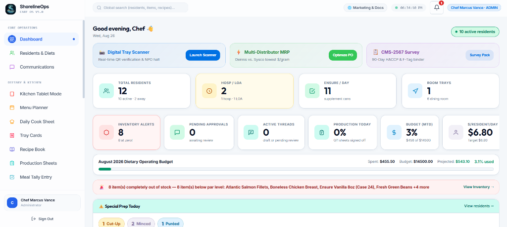
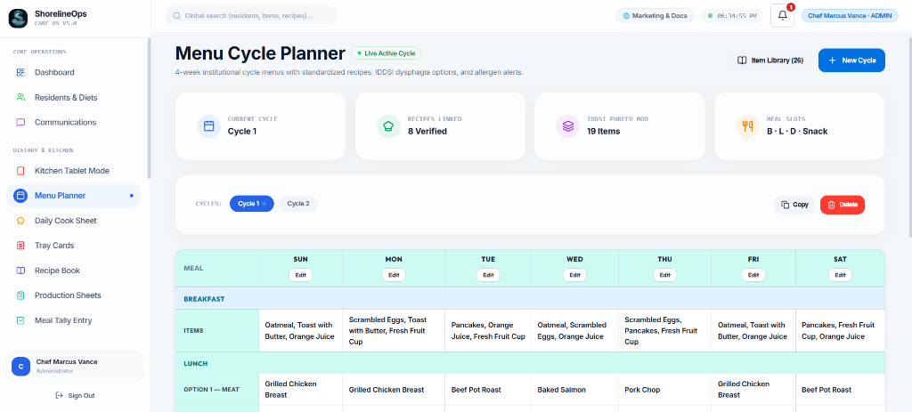
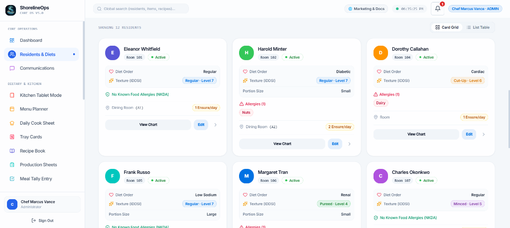
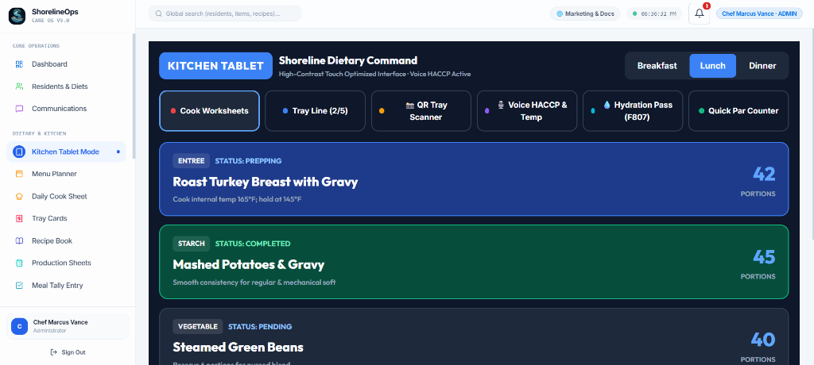
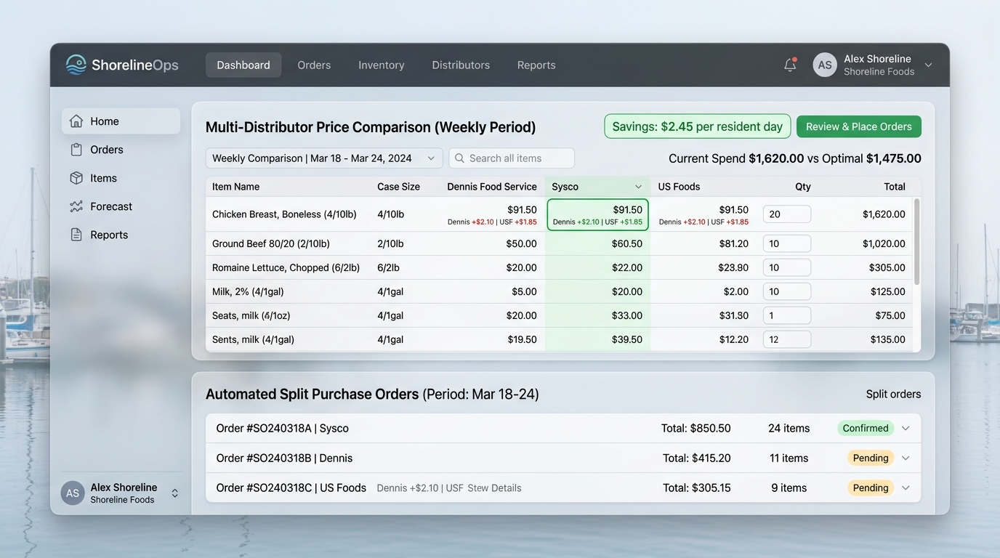
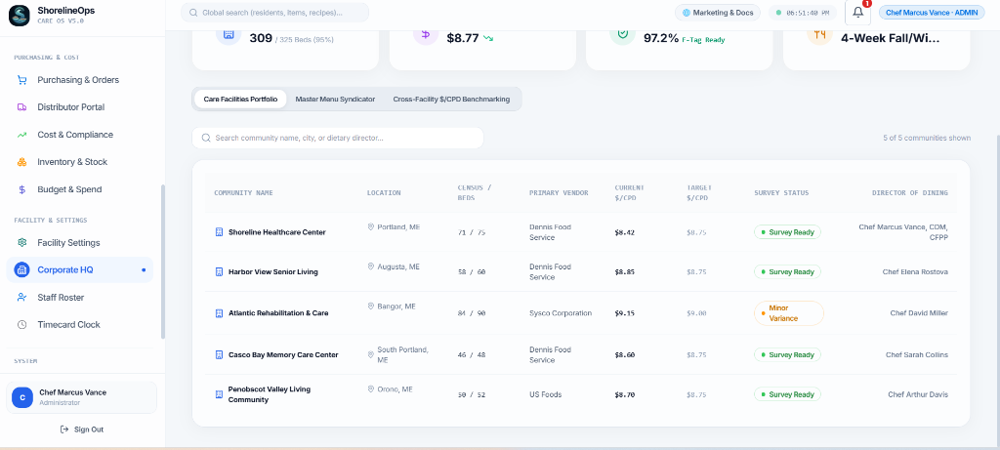

<div align="center">


### Open-Source Healthcare Dietary Operations, Clinical Nutrition & Care Coordination Platform

[](LICENSING.md)
[](#-design-system--uiux)
[](SECURITY.md)
[-brightgreen.svg)](#-automated-testing)
[](docs/RenderDeployment.md)

**Engineered by a healthcare executive chef, not a venture fund.**  
*Bridging clinical resident diets, IDDSI dysphagia safety, touch tablet batch cookery, multi-distributor split MRP purchasing, and CMS-2567 federal survey readiness.*

[🚀 Live Demo App](https://shoreline-demo.onrender.com/menu) • [🌐 Marketing & Pricing Portal](https://shoreline-marketing.onrender.com) • [🏢 Corporate HQ Portal](https://shoreline-demo.onrender.com/enterprise) • [🔑 Open Core Licensing](LICENSING.md) • [📋 Daily Operations Audit](docs/DAILY_OPERATIONS_AUDIT.md) • [🎯 Pilot Acquisition Guide](docs/FACILITY_PILOT_ACQUISITION_AND_SCALE.md)

</div>

---

## 📸 Platform Interface Tour

```
┌────────────────────────────────────────────────────────────────────────────────────────┐
│                                 CORE APPLICATION MODULES                                │
├──────────────────────────┬───────────────────────────┬─────────────────────────────────┤
│ 1. Executive Dashboard   │ 2. Menu Cycle Planner     │ 3. Residents & IDDSI Dysphagia  │
│ 4. Kitchen Tablet Kiosk  │ 5. Split MRP Purchasing   │ 6. Corporate HQ Multi-Facility  │
│ 7. CMS-2567 Survey Binder│ 8. Vendor Partner Portal  │ 9. Facility Profile & Standards │
└──────────────────────────┴───────────────────────────┴─────────────────────────────────┘
```

### 1. 📊 Executive Culinary & Clinical Dashboard (`/`)
*Real-time census tracking, food cost per resident day ($/CPD) budget variance gauges, active IDDSI texture distribution, and clinical allergen alerts.*



### 2. 📅 4-Week Seasonal Cycle Menu Planner (`/menu`)
*4-week institutional cycle menus with standardized recipes, IDDSI dysphagia texture options, and real-time allergen collision warnings.*



### 3. 👥 Clinical Residents Roster & IDDSI Dysphagia Orders (`/residents`)
*Therapeutic diet orders (NAS, NCS, Renal), IDDSI Level 4 Pureed badges, allergen warnings, table seating, and PointClickCare EHR triage queue.*



### 4. 📱 Kitchen Touch Tablet Kiosk & Hands-Free Voice HACCP (`/kitchen/tablet`)
*Large touch targets (44px+) designed for cooks wearing wet nitrile gloves during a 45-minute tray rush. Includes Web Speech API hands-free core temperature logging (165°F poultry, 145°F fish) and CMS F807 resident hydration pass tracking.*



### 5. 🚚 Multi-Distributor Lowest-Cost Split MRP (`/purchasing`)
*Compares live contract pricing line-by-line across Dennis Food Service, Sysco, and US Foods, generating optimal split purchase orders that save \$1.50–\$3.00 per resident day (\$2,500+/mo on a 60-bed building).*



### 6. 🏢 Corporate Headquarters Multi-Facility Portal (`/enterprise`)
*Centralized management for senior living operator chains (5–50 buildings). Features 1-click 4-week seasonal cycle menu syndication, portfolio census tracking, and cross-facility $/CPD spend benchmarking.*



---

## 🍽️ What is ShorelineOps?

**ShorelineOps** is an open-source clinical nutrition and dietary operations platform designed for senior living and healthcare dining (Assisted Living, Memory Care, Skilled Nursing Facilities, CCRCs, and Acute Care Hospitals).

In healthcare dining, culinary operations are clinical care:
- **Dysphagia & Texture Modification**: Swallowing disorders require strict adherence to the **IDDSI framework** (Levels 0–7: Regular, Soft & Bite-Sized, Minced & Moist, Pureed, Liquidised, Thickened Liquids).
- **Deterministic Allergen Intersection**: Food allergies (Dairy, Gluten, Shellfish, Tree Nuts, Soy, Egg) are cross-referenced against standardized recipe bill-of-materials in real-time with non-overridable hard-blocks.
- **State Survey Readiness**: Federal regulations require comprehensive documentation under **CMS State Operations Manual Appendix PP (F-Tags F800–F814)**, including the 14-hour dinner-to-breakfast rule (F809).
- **Distributor Spend Optimization**: Eliminates distributor lock-in by comparing Broadline order guides (**Dennis Food Service, Sysco, US Foods, Gordon Food Service, PFG**) to guarantee lowest case-pack costs.

---

## 🧭 Complete System Architecture

```
                                  ┌───────────────────────────────┐
                                  │ 1. CLINICAL DIET & EHR ORDERS │
                                  │ • PointClickCare 2-Way Sync   │
                                  │ • IDDSI Pureed / Minced Textures│
                                  │ • Highlighted Allergen Flags  │
                                  └───────────────┬───────────────┘
                                                  │
                                                  ▼
┌───────────────────────────────┐ ┌───────────────────────────────┐ ┌───────────────────────────────┐
│ 2. MENU & RECIPE PLANNING     │ │ 3. KITCHEN TABLET & TRAY SCAN │ │ 4. MULTI-DISTRIBUTOR MRP      │
│ • 4-Week Cycle Menu Engine    │ │ • Batch Cook Worksheets       │ │ • Lowest-Cost Split PO Engine │
│ • USDA Nutritional Solver     │─┼▶ • Digital Tray Card Scanner  │─┼▶ • Dennis & Sysco EDI Sync    │
│ • Bill of Materials Explosion │ │ • HACCP 165°F Voice Temp Logs │ │ • 3-Way Invoice Match & Memos │
└───────────────────────────────┘ └───────────────────────────────┘ └───────────────────────────────┘
                                                  │
                                                  ▼
                                  ┌───────────────────────────────┐
                                  │ 5. CMS-2567 SURVEY BINDER     │
                                  │ • 1-Click F-Tag Audit Crosswalk│
                                  │ • 14-Hour Meal Timing Logs    │
                                  │ • Food Cost ($/CPD) Auditing  │
                                  └───────────────────────────────┘
```

---

## 🌟 Core Modules & Capabilities

| Module | Route | Key Capabilities | Target User |
|---|---|---|---|
| **Executive Dashboard** | `/` | Census telemetry, $/CPD cost gauges, IDDSI distribution chart, real-time safety alerts | Executive Dir / CDM |
| **Residents & Diets** | `/residents` | Therapeutic diets (NAS, NCS, Renal), IDDSI levels, allergies, PointClickCare EHR triage queue | Registered Dietitian |
| **Menu Cycle Planner** | `/menu` | 4-week cycle menus, Choice A/B alternates, recipe drawer, nutrition totals | Executive Chef |
| **Batch Production** | `/production` | Scaled prep sheets, cooking stations (Hot Line, Cold Prep, Puree), 165°F HACCP temp logs | Line Cooks |
| **Standardized Recipes** | `/recipes` | Master recipe book, ingredient scaling, Big 9 allergen detector, USDA nutrient solver | Cooks & Bakers |
| **Kitchen Tablet Kiosk** | `/kitchen/tablet` | Glove-friendly touch worksheets, voice HACCP logger, CMS F807 hydration pass | Line Cooks & Aides |
| **Digital Tray Cards** | `/kitchen/traycards` | High-contrast thermal tickets, signed QR tokens, barcode assembly verification | Dining Aides |
| **Purchasing & Split MRP** | `/purchasing` | Dennis/Sysco order guides, lowest-cost split POs, 3-way invoice match, credit memos | Dietary Director |
| **CMS Survey Reporting** | `/reporting` | 1-click CMS-2567 digital survey binder (F800–F814), $/CPD cost audits, substitution logs | Administrator / CDM |
| **Corporate HQ Portal** | `/enterprise` | Multi-facility chain oversight, central 4-week menu syndicator, cross-facility $/CPD benchmarks | Corporate VP of Dining |
| **Vendor Partner Portal** | `/distributor` | Distributor catalog master, rep role login, inline SKU pricing editor, delivery schedules, CSV tools | Vendor Sales Reps |
| **Facility Settings** | `/settings` | Facility profile, wings & dining rooms, CPD budget solver, meal schedule times | System Admin |

---

## 🔑 Open Core Licensing Model

ShorelineOps uses an **Open Core** architecture:

```
┌────────────────────────────────────────────────────────────────────────────────────────┐
│ 🆓 COMMUNITY CORE (100% Free & Open Source)                                             │
│ • Unlimited Resident Census & Diet Orders      • 4-Week Cycle Menu Planner             │
│ • Standardized Recipe Yield Scaler             • Kitchen Batch Worksheets & Tray Cards │
│ • Local Timecard Punch Kiosk                   • Offline SQLite & PostgreSQL Support   │
├────────────────────────────────────────────────────────────────────────────────────────┤
│ 💼 PRO CLOUD SAAS ($199 / month / facility)                                            │
│ • Multi-Distributor Lowest-Cost Split MRP      • USDA FoodData Central 8,000+ Database │
│ • Cloud Multi-Device Real-Time Sync            • Automated Distributor Order Export    │
│ • Hands-Free Voice HACCP 165°F Temp Logger     • Signed Business Associate Agreement   │
├────────────────────────────────────────────────────────────────────────────────────────┤
│ 🏢 ENTERPRISE CARE NETWORK ($399 / month / facility)                                   │
│ • PointClickCare Live 2-Way EHR Sync           • CMS-2567 Digital Survey Ready Binder  │
│ • 3-Way Delivery Invoice OCR & Credit Memos    • Corporate HQ Multi-Facility Portal    │
│ • Master 4-Week Cycle Menu Syndicator          • Portfolio $/CPD Spend Benchmarking    │
└────────────────────────────────────────────────────────────────────────────────────────┘
```

---

## 🤖 Autonomous Dietary Operations Consultant

ShorelineOps includes an autonomous **Dietary Operations Consultant Agent** (`dietary_operations_consultant`):
- **Continuous Auditing**: Evaluates clinical IDDSI constraints, kitchen ergonomics, supply chain price variances, and CMS survey compliance.
- **Run Audit On-Demand**:
  ```bash
  npm run audit:operations
  ```
- **Master Audit Log**: Inspect [`docs/DAILY_OPERATIONS_AUDIT.md`](docs/DAILY_OPERATIONS_AUDIT.md) for live focus questions and operational stress-test results.

---

## 🛠️ Quickstart & Local Development

### 1. Prerequisites
- Node.js $\ge 20.0.0$
- npm $\ge 10.0.0$

### 2. Clone & Install
```bash
git clone https://github.com/ShadowWalkerNC/ShorelineOps.git
cd ShorelineOps
npm install
```

### 3. Start Development Servers
```bash
# Starts both the React frontend (port 5180) and Express API (port 3015)
npm run dev:all
```
- Web Application: `http://localhost:5180`
- Backend API Server: `http://localhost:3015`
- Astro Marketing Site: `http://localhost:4321` (via `cd marketing && npm run dev`)

### 4. Run Automated Test Suite
```bash
npm test
```
All **118 system integration, clinical dietary, and safety test suites** pass with 100% success rate across 26 operational domains.

---

## 🚢 Render 1-Click Cloud Deployment

Deploy the complete multi-service stack to Render using the official [`render.yaml`](render.yaml) Blueprint:

1. Sign in to your [Render Dashboard](https://dashboard.render.com).
2. Click **New +** $\to$ **Blueprint**.
3. Connect your repository: `ShadowWalkerNC/ShorelineOps`.
4. Render provisions and builds all 4 services automatically:
   - `shoreline-api` (Node/Express API on port 3015)
   - `shoreline-demo` (React 18 + Vite SPA on `https://shoreline-demo.onrender.com`)
   - `shoreline-marketing` (Astro static portal on `https://shoreline-marketing.onrender.com`)
   - `shoreline-db` (Managed PostgreSQL instance)

See [`docs/RenderDeployment.md`](docs/RenderDeployment.md) for complete deployment instructions and troubleshooting.


## 🖥️ CLI & Developer Tools

ShorelineOps ships a unified **command-line interface** (also aliased as `culinaryos`) that gives programmatic control over every clinical, culinary, purchasing, and compliance module. Use it from your terminal, CI/CD pipeline, or as a backend for custom integrations, MCP agents, and SDK calls.

```bash
# Via npm script
npm run cli -- <command> [subcommand] [flags]

# After npm link or global install
shoreline <command>
culinaryos <command>
```

### Quick Command Reference

| Command | What it does |
|---|---|
| `shoreline residents` | Show active census — diet orders, textures, NPO status |
| `shoreline residents triage` | Print the RD clinical EHR triage queue |
| `shoreline menu audit` | Run CMS F800–F809 & USDA nutritional compliance audit |
| `shoreline production split --census=60` | Station demand split (Steam Table, Puree L4, Minced L5, Soft L6) |
| `shoreline production ap-ep --ep-demand=15` | AP vs EP yield loss & case-pack calculator |
| `shoreline kitchen verify-tray --resident-id=SH-001` | Clinical tray verification with NPO hard-block & allergen check |
| `shoreline kitchen log-temp --item="Turkey" --temp=168` | HACCP 165°F food safety temperature log |
| `shoreline purchasing split-po --item="Turkey Breast"` | Multi-distributor lowest-cost split MRP (Dennis vs Sysco) |
| `shoreline survey cms-binder` | Generate CMS-2567 F-Tag survey compliance binder |
| `shoreline survey cpd` | Cost per resident day ($/CPD) analytics |
| `shoreline mcp tools` | List all MCP tools available for AI agent integration |
| `shoreline doctor` | Full system health diagnostic scan |

### Machine-Readable JSON Output

Every command supports `--json` for structured output — ideal for piping into MCP agents, SDK calls, or custom integrations:

```bash
shoreline residents --json
shoreline purchasing split-po --item="Boneless Turkey" --json
shoreline survey cms-binder --json
```

### MCP & Agent Integration

The built-in MCP server (`server/src/mcp/server.ts`) exposes 5 tool definitions:
- `shoreline_get_facility_profile`
- `shoreline_get_census_diets`
- `shoreline_validate_recipe_dietary`
- `shoreline_explode_mrp_bom`
- `shoreline_run_self_healing_audit`

### Developer Ecosystem Roadmap

| Layer | Status |
|---|---|
| **CLI** (`shoreline` / `culinaryos`) | ✅ Production |
| **MCP Server** (`server/src/mcp/server.ts`) | ✅ Production |
| **REST API** (Express, port 3015) | ✅ Production |
| **SDK** (`@shoreline/sdk` — TypeScript) | ✅ v6.0 Shipped |
| **Webhook Events** (HMAC-SHA256 signed) | ✅ v6.0 Shipped |

See [`docs/CLI_REFERENCE.md`](docs/CLI_REFERENCE.md) for the complete command reference and [`docs/SDK_REFERENCE.md`](docs/SDK_REFERENCE.md) for the TypeScript SDK.

---

## 🔧 v6.0 Hardware & Integration

### TypeScript SDK

```ts
import { ShorelineClient } from '@shoreline/sdk'

const client = new ShorelineClient({
  baseUrl: 'https://your-facility.shorelineops.com',
  apiKey: process.env.SHORELINE_API_KEY,
})

const residents = await client.getResidents()
const po = await client.getMrpSplitPo('Turkey Breast', 45)
const health = await client.runHealthCheck()
```

### Webhook Events

Register an endpoint to receive signed events from your facility:

```bash
curl -X POST https://your-api/api/webhooks/subscribe \
  -d '{"url":"https://your-app.com/hooks","secret":"your-secret"}'
```

Events: `ehr.triage.pending` · `haccp.temp.violation` · `cpd.variance.alert` · `npo.block.triggered` · `mrp.po.generated`

See [`docs/WEBHOOKS.md`](docs/WEBHOOKS.md) for HMAC verification and payload schemas.

### Thermal Tray Card Printing & Bluetooth HACCP Probes

```bash
# List configured thermal printers (Zebra ZD421, Brother QL-1110NWB, etc.)
shoreline hardware printers

# Generate a 4×6 tray card label job
shoreline hardware print-tray --resident-id=SH-001 --json

# Read Bluetooth HACCP probe temperature (fires webhook on violation)
shoreline hardware probe-temp --probe-id=PROBE-001
```

REST: `POST /api/hardware/print/tray-card` · `GET /api/hardware/probes` · `POST /api/hardware/probes/:id/log-haccp`

See [`docs/HARDWARE.md`](docs/HARDWARE.md) for supported hardware models and integration guide.

---

## 📄 Compliance & Legal
- [Master Commercial Services Agreement (MSA)](COMMERCIAL_AGREEMENT.md)
- [Business Associate Agreement (BAA)](BAA.md)
- [HIPAA Notice of Privacy Practices](HIPAA_NOTICE.md)
- [Open Core Licensing Guide](LICENSING.md)
