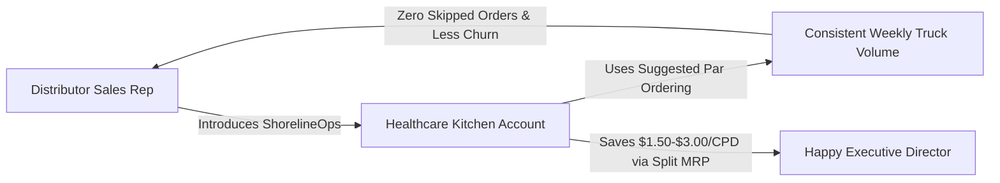
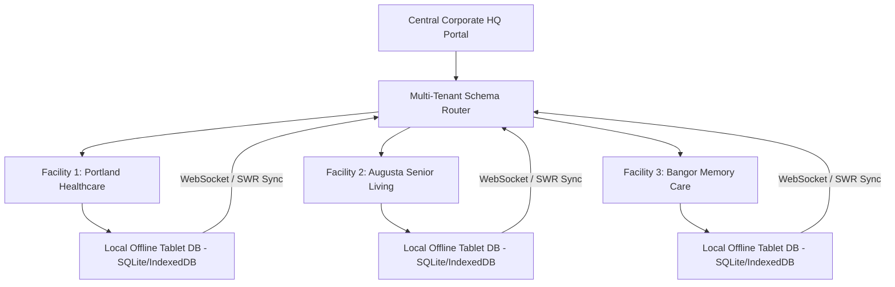

# ShorelineOps — Facility Pilot Acquisition & Enterprise Scale Master Blueprint

> **Purpose:** Step-by-step roadmap to acquire pilot healthcare facilities, scale to multi-building senior living chains, and add high-leverage enterprise features.

---

## 🎯 Part 1: How to Find & Close Initial Pilot Facilities

### 1. The 3 Target Facility Archetypes (Where to Focus)

| Facility Type | Ideal Size | Decision Makers | Why They Will Test ShorelineOps |
|---|:---:|---|---|
| **Independent Assisted Living / Memory Care** (Primary Target) | 40–90 Beds | Executive Director (ED), Dietary Manager / Chef | Frustrated by clipboard guesswork, high food bills ($12+/CPD), and lack of modern software. Decisions made in **48–72 hours**. |
| **Regional Senior Living Operators** (Secondary Target) | 3–10 Buildings | VP of Dining, Regional RD, COO | Want centralized menu standardization, $/CPD cross-facility benchmarking, and distributor split savings across their portfolio. |
| **Independent Skilled Nursing (SNF)** | 50–120 Beds | Director of Nursing (DON), Administrator, CDM | Terrified of state survey citations (CMS F804 IDDSI, F808 Therapeutic Diets, F809 14-Hour Rule). Need the **CMS-2567 Digital Survey Binder**. |

> [!TIP]
> **Avoid massive 500+ bed hospital systems initially.** They have 9–14 month procurement cycles and rigid enterprise IT committees. Target 40–80 bed independent regional facilities where the Executive Director and Chef can say "yes" this week.

---

### 2. The Distributor Rep Growth Flywheel (The #1 Channel)

Broadline food distributor sales reps (**Dennis Food Service, Sysco, US Foods, Gordon Food Service**) are your highest-leverage acquisition channel.



#### Why Reps Will Walk You Into Facilities:
1. **Guaranteed Order Consistency**: When kitchens use clipboards, they forget items, skip delivery cycles, or run out of emergency thickener. Suggested par ordering guarantees weekly truck volume.
2. **Protects Rep Commissions**: Reduces account churn and eliminates emergency off-schedule rush deliveries.
3. **Dedicated Rep Portal (`/distributor`)**: Reps can update SKUs, pack sizes, and contract rates without messy email chains.

#### Rep Outreach Script (LinkedIn / Email / Coffee Meetup):
```text
Subject: Helping your healthcare dining accounts maintain consistent weekly order volume

Hi [Rep Name],

I noticed you manage healthcare and senior living broadline accounts for [Dennis Food Service / Sysco] across [Region/State].

We built ShorelineOps—a free open-source dietary operations and par-level suggested ordering platform specifically for assisted living and memory care kitchens.

We're currently setting up local 40-80 bed facilities with pre-loaded [Dennis/Sysco] order guides and automated par calculators so their kitchen staff never skips replenishment cycles or runs short on thickener and purees.

Could I buy you a coffee this week or do a quick 10-minute call to show you how our distributor portal works? We can pre-format your order guide for your top 3 accounts at zero cost to you or them.

Best regards,
[Your Name]
ShorelineOps Healthcare Operations
```

---

### 3. Direct Cold Outreach to Facility Executive Directors

#### The "Free Survey Audit & $/CPD Savings" Email Script:
```text
Subject: Reducing raw food spend by $1.50/CPD at [Facility Name] + CMS-2567 Binder

Hi [Executive Director Name],

Most assisted living and memory care facilities we speak with in [State/Region] are seeing raw food costs spike above $10.50 per resident day, while dietary teams still struggle with dry-erase boards, IDDSI puree modifications, and state survey binders.

We built ShorelineOps—a healthcare dietary operations platform designed by an executive chef and Certified Dietary Manager.

We'd love to offer [Facility Name] a 30-Day Zero-Risk Pilot:
1. We will digitize your cycle menu and Dennis/Sysco order guide in under 24 hours.
2. We'll deploy our touch tablet kitchen mode with live IDDSI puree & allergen hard-blocks.
3. We'll run our Lowest-Cost Split MRP engine to prove an immediate $1.50–$3.00 savings per resident day ($2,000–$4,000/mo saved on your food budget).

Would you or your Dietary Director have 15 minutes this Thursday for a live sandbox preview?

Best regards,
[Your Name]
ShorelineOps | (207) 555-0199
https://shoreline-demo.onrender.com/menu
```

---

## 🚀 Part 2: The 30-Day Zero-Risk Facility Pilot Playbook

```
Week 1: Zero-Effort Setup (15 Mins) ➔ Week 2: Kitchen Tablet Kiosk ➔ Week 3: Split MRP Savings Audit ➔ Week 4: Conversion
```

1. **Week 1 (Onboarding & Data Setup)**:
   - Facility provides their current resident census roster and primary vendor CSV order guide.
   - You import the data in under 15 minutes.
2. **Week 2 (Kitchen Floor Trial)**:
   - Provide the kitchen with a pre-configured tablet (or mount an iPad on the prep line).
   - Cooks use the large-button touchscreen for daily batch scaling, HACCP temps, and tray cards.
3. **Week 3 (Financial & Clinical ROI Audit)**:
   - Generate the **Cost Per Resident Day ($/CPD)** report and **Lowest-Cost Split MRP** comparison.
   - Show the Executive Director the exact dollar amount saved ($2,000–$4,500/mo).
4. **Week 4 (SaaS Conversion)**:
   - The verified food savings ($2,500+/mo) makes the $199/mo Pro Cloud SaaS a **12x return on investment**.

---

## 🏗️ Part 3: Architecture for Enterprise & Large-Scale Expansion

To scale ShorelineOps from single independent buildings to multi-facility care chains (50–500 locations), implement these architectural layers:



### 1. Multi-Tenant Enterprise Data Isolation
- **Row-Level Security (RLS) & Tenant Routing**:
  - Each facility is mapped to a tenant ID (`facility_id`) in PostgreSQL with schema partitioning or RLS policies.
  - Custom vanity domains: `portland.shorelinecare.com`, `augusta.shorelinecare.com`.

### 2. Corporate HQ Centralized Menu & Spend Syndication (`/enterprise`)
- **Master Menu Publishing**: Corporate Executive Chefs create a master 4-week cycle menu and syndicate it across 20 buildings with 1 click. Individual facilities inherit the master cycle while customizing local resident counts.
- **Cross-Facility $/CPD Benchmarking**: High-level corporate dashboard comparing raw food cost per resident day across every building in the portfolio.

### 3. Direct EDI 850 / 810 Transmission Engine
- Direct ANSI ASC X12 EDI transmission (`EDI 850 Purchase Order`, `EDI 855 PO Acknowledgment`, `EDI 856 Advanced Shipping Notice`, `EDI 810 Invoice`) via secure AS2/SFTP direct to distributor mainframes.

### 4. Voice-Activated Kitchen Logging
- Integration of the browser Web Speech API on the Kitchen Tablet Kiosk for hands-free HACCP temperature recording:
  - Cook speaks: *"Chicken breast holding at 168 degrees, pan 2"*
  - System parses temperature, station, and logs timecode with zero touch.

---

## 📅 Part 4: Implementation Roadmap Summary

```
Q1: Initial 5-10 Pilot Facilities (Maine & New England Regional Focus)
Q2: Distributor Rep Formal Integration & EDI 850 Automation
Q3: Multi-Facility Corporate Chain Portal & Centralized Menu Syndication
Q4: National Expansion (Assisted Living & Memory Care Operator Networks)
```
