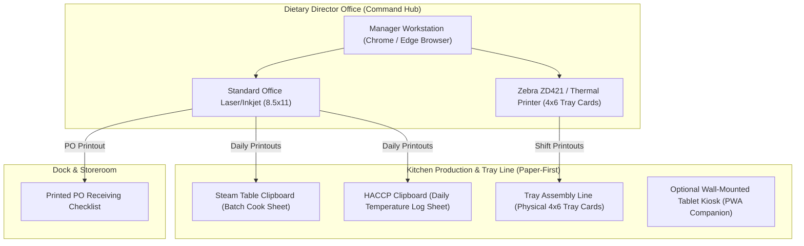
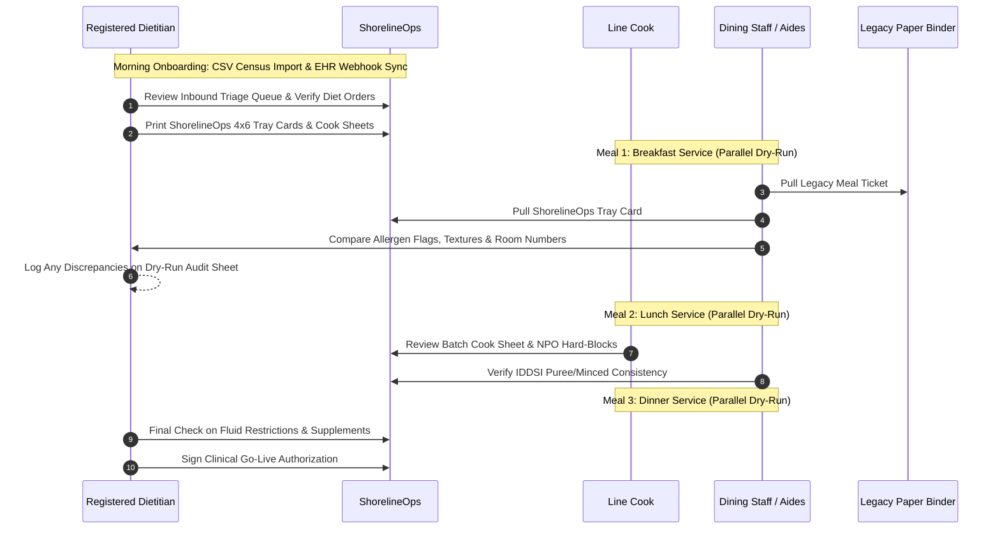
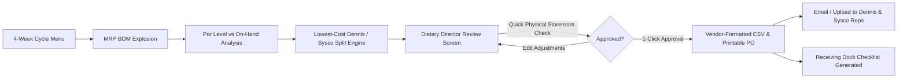

# Shoreline Care OS — Facility Pilot Deployment & Go-Live Runbook

> **Target Audience:** Facility Executive Directors, Dietary Managers / Chefs, Registered Dietitians (RD), and Implementation Consultants.  
> **Facility Scope:** Independent Assisted Living, Memory Care, and Skilled Nursing Facilities (SNF) (40–120 beds).  
> **Standard:** Paper-First Clinical Safety & Regulatory Compliance (CMS State Operations Manual Appendix PP).

---

## 1. Operational Philosophy: Paper-First Healthcare Compliance

In skilled nursing and senior living dining operations, **paper is the primary legal, clinical, and regulatory medium of record**. While ShorelineOps provides real-time PWA tablet kiosks and Bluetooth LE probe telemetry, the physical dining room and cook line operate on durable printed documentation:

1. **Physical Tray Cards (4×6 Thermal or Letter Size)**:
   - Placed directly on every resident meal tray on the assembly line.
   - High-contrast typography displaying resident name, room number, therapeutic diet order, IDDSI texture modification, fluid consistency, adaptive feeding equipment, and bold red allergen warnings.
   - Inspected by state Department of Health surveyors during meal observation passes (CMS F804 / F808).
2. **Batch Production Cook Sheets (Clipboard at Hot Line Steam Table)**:
   - Printed daily for line cooks showing portion scaling, station routing, and recipe instructions.
   - Includes bold **NPO Hard-Block alerts** and per-batch allergen summaries so cooks never prepare prohibited food.
3. **Daily HACCP Temperature Log Sheets (Clipboard at Cook Line / Walk-In)**:
   - Maintained with physical probe holster at cook lines, dish machines, walk-in coolers, and steam tables.
   - Captures time, equipment/food item, temperature, staff signature, and mandatory corrective action for out-of-range readings (CMS F812).
4. **Resident Cycle Menus**:
   - Printed 4-week cycle menus posted visibly on dining room community boards as mandated by federal regulations.
5. **Digital Kiosks & Touch Tablets**:
   - Positioned as an **optional companion tool** for digital ticking, voice temperature entry, and real-time inventory adjustments. Never a single point of failure.

---

## 2. Facility Hardware Topology (Docked Office Workstation + Printer)

### Hardware Checklist

| Station | Equipment | Primary Function | Failure Mode / Redundancy |
|---|---|---|---|
| **Dietary Office** | PC / Mac / Chromebox | Census management, cycle planning, MRP split ordering, survey binder export | Browser-based; accessible from any workstation |
| **Dietary Office** | Standard Printer (8.5×11) | Batch cook sheets, daily HACCP logs, cycle menus, vendor purchase orders | Standard local network printer |
| **Tray Line** | Zebra ZD421 (or 4-up Letter) | Point-of-service 4×6 clinical tray cards | Fallback to 4-up standard cardstock paper |
| **Cook Line** | Standard Clipboards (×3) | 1) Batch Cook Sheet, 2) HACCP Temp Log, 3) Dish Machine Sanitizer Log | Always functional regardless of Wi-Fi |
| **Optional Companion** | 10" Android/iPad Tablet | Real-time tray ticking, WebBluetooth probe pairing, voice temp logging | Offline PWA queue with auto-reconnect |

---

## 3. Day-1 Clinical Safety Dry-Run: 3-Meal Parallel Service Protocol

To eliminate clinical risk, ShorelineOps enforces a **3-Meal Parallel Service** prior to full system cutover:

### Dry-Run Verification Steps

1. **Census Cross-Check**:
   - Verify every active resident in Wing A, B, and Memory Care is accounted for.
   - Confirm room and table assignments match current floor roster.
2. **Allergen & NPO Hard-Block Verification**:
   - Compare ShorelineOps allergy alerts against resident medical charts.
   - Ensure all NPO residents show **`NPO HARD-BLOCK`** and are completely excluded from batch cook counts.
3. **IDDSI Texture & Fluid Consistency Alignment**:
   - Verify pureed residents (Level 4) receive pureed labels with proper broth binder instructions.
   - Verify thickened fluids (Level 1–4) match current speech-language pathologist (SLP) orders.
4. **Clinical Sign-Off**:
   - Registered Dietitian and Dietary Director sign the physical parallel audit sheet before discontinuing the legacy binder.

---

## 4. Distributor Order Dispatch Verification: Manager Approval Protocol

To maintain complete fiscal governance, ShorelineOps implements **Manager-Confirmed Ordering**:

### Purchasing Rules

1. **Zero Blind Automated Dispatch**:
   - System never dispatches automated purchase orders without Dietary Director or Executive Director visual confirmation.
2. **60-Second Storeroom Walk-Through**:
   - Manager reviews the suggested order list (`Par - On Hand`).
   - Verifies high-dollar protein cases and emergency thickener inventory before confirming quantities.
3. **Dual-Vendor Split Optimization**:
   - Dennis Food Service broadline contract items exported in Dennis-formatted CSV.
   - Sysco items exported in Sysco order format.
   - Lowest-cost split saves $1.50–$3.00 per resident day ($/CPD).
4. **Receiving & 3-Way Match**:
   - When distributor delivery truck arrives, receiving dock staff uses printed PO to verify delivered quantities.
   - Invoice scanned or entered for automated 3-way price and quantity matching with vendor credit memo generation.

---

## 5. Unannounced CMS-2567 State Survey Readiness

When a state health inspector or CMS surveyor arrives unannounced:

1. **Activate Surveyor Read-Only Mode**:
   - Navigate to **Reporting → CMS-2567 Survey Binder**.
   - Toggle **`Surveyor Read-Only Mode`** on.
   - Sensitive facility finances ($/CPD, food spend, proprietary vendor discounts) are instantly masked.
2. **Hand Over Printed Binder or Dedicated Inspection Tablet**:
   - Hand surveyor the physical clipboard binder containing 30-day HACCP logs, cycle menus, and substitution records.
   - Or hand surveyor an inspection tablet locked in Surveyor Guest Mode.
3. **1-Click Survey Artifacts**:
   - Click **Download CMS-2567 Survey Binder (Markdown/PDF)**.
   - Click **Export 30-Day HACCP Evidence (JSON/CSV)**.
   - All citations (F800 through F814) present verified audit evidence trails.
