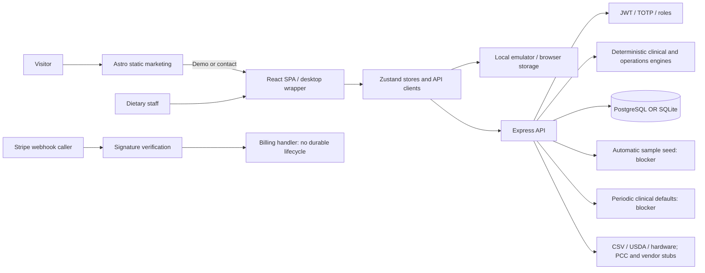

# CulinaryOS repository intelligence report

Audit: 2026-09-20 · Checkout: `409c752` · Product: ShorelineOps / Shoreline Care OS · Mode: audit only.

## Executive summary

**Recommendation: internal testing with synthetic records only. No paid or clinical production launch approval.** This is a substantial healthcare dietary operations application, not merely a landing page. React workflows, Express APIs, migrations, deterministic safety engines and a real automated test harness exist. Local client/server/marketing builds pass and 228 system assertions pass against disposable SQLite. These results do not establish clinical safety, complete workflows, production isolation or commercial readiness.

**Verified blockers:** production startup runs a sample-account seed; MFA-pending tokens pass normal authentication; resident admission drops NPO/fluid fields; a periodic “healer” replaces missing clinical orders with Regular/Regular; failed resident writes can appear saved locally; tray verification failures can trigger simulated success feedback; user administration operates in memory. Shared-facility isolation and self-service billing are unfinished. The CI workflow has a build step without an executable command. Public readiness and compliance claims exceed available evidence.

**Likely maturity:** internal alpha with some mature components and significant integration debt. Repository labels such as “production-ready” and “100% operational uptime” are documentation claims, not validation. Customer demand, active deployments, contracts, operating margins and production controls remain **Unknown**.

Evidence: `server/src/index.ts:248`, `server/src/db/seed.ts:255`, `server/src/routes/residents.ts:523`, `server/src/agent/healer.ts:78`, `src/state/residentsStore.ts:108`, `src/state/adminStore.ts:1`, `docs/DAILY_OPERATIONS_AUDIT.md` executive summary; detailed findings in [security/data evidence](SECURITY_DATA_EVIDENCE.md) and [product/UX evidence](PRODUCT_UX_EVIDENCE.md).

## Method, confidence and boundaries

- **Verified:** directly observed source/configuration or explicitly identified executed check. Source verification does not mean a deployed exploit or browser journey was exercised.
- **Likely:** inference supported by code, pending runtime/customer validation.
- **Assumption:** proposed planning input requiring founder confirmation.
- **Unknown:** unavailable evidence, not automatically a defect.
- **Risk:** possible harm requiring validation or remediation.

Initial git working tree was clean. Changes are confined to audit documentation and an isolated verification harness; ordinary ignored build artifacts were regenerated. No application source, environment files, migrations, production data, infrastructure, domains, payment accounts or remote communications were changed. Builds used existing dependencies, not a fresh lockfile install. The local runtime was Node 24.21.0/npm 11.19.0; configured CI uses Node 20 and Docker uses Node 22, so cross-runtime parity is unverified.

Project `AGENTS.md` and the five named session documents were inspected. The inherited `ShadowWalkerNC/.github/AGENTS.md` was not found locally; attempts to retrieve its main-branch raw and GitHub URLs failed. Global guidance therefore remains an access limitation. `.env` secret values were not inspected or published. No cloud console, production database, live provider credentials, customer interviews, executed agreements or incident evidence were supplied. Existing screenshots were inventoried, not treated as current QA evidence.

## Project identity

| Item | Finding | Confidence / evidence |
|---|---|---|
| Project/product | ShorelineOps, marketed as Shoreline Care OS | Verified: README, package.json, marketing homepage |
| Company relationship | Founder requests delivery under CulinaryOS LLC; legal site names Shoreline Operations LLC | Verified discrepancy: user brief; `marketing/src/pages/terms.astro:66`; legal relationship Unknown |
| Repository | npm workspace with React SPA, Express server, Astro marketing, SDK, Electron/installer tooling | Verified: package.json and directories |
| Intended customer | Senior living and healthcare dietary teams; administrators, dietitians, dietary managers, cooks/aides | Verified positioning: README, ARCHITECTURE |
| First segment | Single 40–120-bed facility with founder-led onboarding | Assumption recommended from `docs/PILOT_GO_LIVE_RUNBOOK.md`; not validated demand |
| Problem | Reconcile census/diets with menus, production, tray service and purchasing evidence | Verified implemented domains; customer frequency/cost Unknown |
| Value proposition | One reviewable daily dietary workflow from census to printed kitchen outputs | Likely strongest scope; no verified ROI or willingness to pay |
| Maturity | Internal alpha, despite production-ready descriptions | Likely, based on blockers and absent release evidence |
| Version | root 5.0.0; API/marketing 1.0.0; changelog uses later release labels | Verified drift: manifests and CHANGELOG |

## Technology inventory

Versions below are resolved root-lock versions, not assurances that every independent deployment uses that lock.

| Area | Technology | Version | Evidence | Risk / notes |
|---|---|---|---|---|
| Frontend | React, Vite, TypeScript, Zustand, Tailwind/Radix wrappers | 18.3.1 / 5.4.21 / 5.9.3 / 4.5.7; Tailwind manifest ^3.4.4 | package.json, package-lock.json, src/main.tsx | Large eager SPA; mixed persistence paths |
| Backend | Express + Node | 4.22.2; local Node 24.21.0 | server/package.json, server/src/index.ts | CI20/container22 drift; no full API regression suite |
| Database | pg + sqlite3; canonical SQL migrations and SQLite translation | 8.23.0 / 6.0.1 | server/src/db/pool.ts, migrate.ts | PostgreSQL not exercised; translation drops constraints/defaults |
| Authentication | JWT, bcryptjs, OTPAuth TOTP, refresh tokens | jsonwebtoken 9.0.3; bcryptjs 2.4.3 | routes/auth.ts, middleware/requireAuth.ts | Actual hashing is bcrypt, not claimed Argon2; MFA token confusion |
| Hosting | Render blueprint, Vercel static, Docker/nginx, local desktop | manifests use Node20/22 | render.yaml, vercel.json, Dockerfile, electron-main.js | Configuration exists; production deployment unverified |
| CI/CD | GitHub Actions | setup-node@v4 / checkout@v4 | .github/workflows/ci.yml | Server build step lacks run/uses |
| Payments | Stripe-shaped signed webhook and engine scaffold | no Stripe SDK in server manifest | routes/billing.ts, billing/stripeEngine.ts | No durable subscription lifecycle or checkout proof |
| Analytics | No funnel instrumentation found | N/A | marketing/src, src search; manifests | Operational reports are not product analytics |
| Monitoring | /health, console output, internal HealerBot | custom | index.ts, agent/healer.ts | No external alert delivery evidence; unsafe clinical auto-remediation |
| Email | Support mailto links; no transactional delivery implementation found | N/A | pricing.astro; billing/stripeEngine.ts | Mailbox operation and password recovery Unknown |
| Storage | SQLite/PostgreSQL plus localStorage, sessionStorage, IndexedDB/service worker | browser-native | state stores, lib/supabase.ts, lib/offlineQueue.ts, sw.ts | Local emulator diverges from server; offline replay unwired |
| Supabase | SDK dependency / compatibility-shaped client | 2.110.7 | package-lock.json, src/lib/supabase.ts | Dependency does not prove managed Supabase hosting; local emulator is active code |
| Marketing | Astro static + Tailwind | 4.16.19 | marketing/package.json; build log | Seven pages build; localhost canonical generated |
| AI/LLM | Rule-based healer + MCP surface; no hosted model client found | custom | server/src/agent/healer.ts, mcp/server.ts | Do not market a validated clinical AI; deterministic automation still needs safety review |

## Repository map and actual architecture

| Area | Entry points / responsibility |
|---|---|
| SPA | src/main.tsx → App.tsx → Layout; route gating via RequireAuth/RequireRole |
| Routes | /setup, /login, /offline; dashboard, residents/profile, menu, production, recipes, inventory, timecards, kitchen orders/sheet/traycards/dispatch, purchasing, distributor, reporting, settings, tasks; staff/profile manager+, admin admin-only |
| Components | src/components/ui Radix/shadcn wrappers; legacy Button/Badge and apple-ui parallel primitives; feature-local UI |
| Client state | src/state stores call src/api or local emulator; tokenManager manages access/refresh; service worker handles assets/cache |
| Backend | server/src/index.ts mounts auth/setup/billing, residents/menu/recipes/production/admin/kitchen/purchasing/distributor/inventory/trayruns/reporting/enterprise/ehr/mcp/webhooks/hardware/timecard |
| Data | server/src/db/migrate.ts sole executing schema; pool.ts PostgreSQL/SQLite adapter; seed.ts sample dataset; no ORM |
| Engines | safetyEvaluator, production, dietaryFormulation, trayTracking, nutrition, costing, MRP, invoicing, cmsSurvey, catalogMatcher, syndication |
| Integrations | dennis/broadline CSV + synthetic catalogs; pointclickcare synthetic census; USDA connector; hardware Bluetooth/TCP printing |
| Test | server/src/system.test.ts custom assertions plus small compliance.test.ts; SDK exercises within system suite |
| Delivery | root/server Dockerfiles, render.yaml, two vercel.json files, nginx/Compose, Setup scripts, installer, Electron |
| Docs | architecture, licensing, clinical/hardware/pilot runbooks, SDK/API docs, historical daily audit; new docs/audits decision package |

No live payment, mail or analytics service is implied by this diagram. Public website and SPA deployments can be separate from API hosting.

## Feature inventory

“Partial” means source exists but release acceptance is incomplete. No row is certified complete from builds alone.

| Feature | Status | Evidence | User value | Quality | Missing pieces | Launch status |
|---|---|---|---|---|---|---|
| Responsive dashboard | Partial | features/dashboard, App.tsx | High | Needs work | Verified aggregates, freshness, mobile observations | Internal testing |
| Census/profile/CSV/diet review | Partial / unsafe paths | residentsStore:108–201; routes/residents:523 | High | Blocking defects | NPO admission, write truth, policy consistency | Do not ship clinical use |
| EHR triage/census | Partial / synthetic connector | integrations/pointclickcare:47–66; routes/ehr | High | Needs live proof | Contract, OAuth exchange, mappings, review/audit | Do not market live |
| Cycle menus/item library | Partial | state/menuStore; features/menu | High | Needs work | Server-authoritative save/error behavior | Internal testing |
| Recipe/yield/allergen/nutrition/costing | Partial | features/recipes; engine/nutrition/costing | High | Substantial engines | Ingredient data validation, provenance, failure durability | Internal testing |
| Production sheets/hydration | Partial | state/productionStore; features/production | High | Needs work | Clinical data consistency, durable signoff, fluid-version handling | Internal testing |
| Kitchen orders/printed sheets | Partial | features/kitchen/OrderEntryPage, KitchenSheetPage | High | Needs safety proof | Fresh orders, role tests, offline limits | Do not ship clinical use |
| Tray print/scan/dispatch | Partial / false success path | TrayAssemblyScanner:66–145; routes/trayruns | High | Blocking defect | Validation must fail closed; physical print scan | Do not ship clinical use |
| HACCP logs/Bluetooth/thermal | Partial | TempLogPanel, server/src/hardware | High | Device unverified | Probe calibration, disconnects, paper legibility and durability | Beta only after evidence |
| Inventory/par/waste | Partial | features/inventory; routes/inventory | High | Needs verification | Units, writes, receiving/stock reconciliation | Internal testing |
| Vendor catalog/CSV import/export | Partial | integrations/dennis, broadline; purchasing UI | High | Useful manual path | Genuine vendor files and human approval | Candidate limited beta scope |
| Split MRP/price matching | Partial | engine/mrp, catalogMatcher | High | Engine tests exist | Actual price provenance, pack match confirmation | No live price claim |
| Invoice matching/credit memos | Partial | engine/invoicing; routes/purchasing | Medium | Needs integration proof | OCR/provider and accounting lifecycle proof | Postpone automation claim |
| CPD/budgets/CMS binder | Partial | features/reporting; engine/cmsSurvey | High | Provenance gaps | Errors distinct from zero, reconciled totals, qualified claims | Internal testing |
| Staff/scheduling/timecard/tasks | Partial | respective features/stores/routes | Medium | Broad scope | Payroll boundary, persistence, identity tests | Postpone expansion |
| Communications/notifications | Partial | state/communicationsStore, notificationsStore | Medium | Delivery Unknown | Durable audience, delivery, permission tests | Internal testing |
| Admin identities/audit/settings | Mock client store | state/adminStore:1–81 | High | Blocking mismatch | Real administrative API binding and revocation proof | Do not ship |
| Facility setup/settings | Partial | SetupWizardPage; routes/setup; settingsStore | High | Defaults/data risks | Explicit consent, atomic bootstrap, SQLite IDs | Internal testing |
| Backup/restore | Partial | BackupRecoveryPanel; routes/admin:808 | High | Auth mismatch risk | Common token client, full restore drill | No recovery promise |
| License/feature gates | Partial / bypassable | middleware/requireTier:10–30 | Medium | Inadequate trust | Signed authoritative entitlement; essential core preserved | No paid self-service |
| Billing | Scaffold | billing/stripeEngine:66–126 | High for SaaS | Incomplete | Durable events/subscriptions, portal, reconciliation | Do not ship |
| Corporate syndication | Mock / parked API | enterpriseStore:142; routes/enterprise | Unvalidated | Incomplete | Real facility isolation and propagation | Postpone |
| PWA/offline | Partial | sw.ts; lib/offlineQueue | High | Claims exceed code | Replay has no callers; stale/queued data and logout rules | Limit promise pending validation |
| Healer diagnostics/MCP | Partial / unsafe automation | agent/healer:78–105; routes/mcp | Medium | Blocking defaults | Never infer missing clinical orders; external monitoring | Diagnostic scope only after repair |
| SDK/CLI/installer/desktop | Partial | sdk, bin, installer, electron-main.js | Medium | SDK test coverage exists | Packaging/install/upgrade proof | Defer promotion beyond pilot need |
| Marketing/legal/sales | Partial | marketing/src/pages; legal .md files | High | Claims/entity conflicts | Evidence-backed claims, correct CTA and company | Revise before promotion |

## User journey inventory

| Journey | Classification | Evidence / required proof |
|---|---|---|
| Land on website / understand purpose | Partially working | Seven static pages build; audience clear; no live browser conversion test |
| Open demo | Unknown runtime | Public demo link exists; no external site QA performed |
| Sign up self-service | Not implemented in inspected routes | App.tsx has setup/login, no customer signup |
| Verify email / recover password | Not implemented in inspected UI | No route or transactional provider found |
| Create facility and initial admin | Partially working | Setup API/UI exists; atomicity, IDs, default consent unresolved |
| Complete onboarding / reach first value | Partially working | Facility wizard exists; no proven census→menu→sheet acceptance run |
| Login/MFA/logout | Partially working | Auth implementation exists; pending-token rejection fails middleware probe |
| Primary menu/production workflow | Partially working | Engines and screens exist; authoritative persistence not proven |
| Safe tray service | Partially working / blocked | NPO admission and scanner/healer defects prevent acceptance |
| Save, refresh, return on second device | Broken under API rejection | Local fallback can diverge; no guaranteed synchronization |
| Invite/manage teammate | Mocked UI administration | adminStore in-memory; real delivery Unknown |
| Trial/upgrade | Partially working | Demo/contact/key paste; no complete subscription flow |
| Billing/downgrade/cancel/reactivate | Not implemented end-to-end | Webhook scaffold does not persist lifecycle |
| Support | Partially working | mailto exists; mailbox delivery/support coverage Unknown |
| Export and recover | Unknown runtime | UI token mismatch; isolated full recovery not performed |
| Delete account/facility data | Not implemented as complete journey | Entity deletion exists; retention/purge/export contract unresolved |

## Issue register: technical debt and quality

IDs are stable cross-references used by the roadmap and test matrix. P0 blocks the relevant launch scope; P1 blocks paid launch or major quality acceptance. No source bug was repaired in this phase.

| ID | Severity | Verified finding / risk | Evidence |
|---|---|---|---|
| SEC-01 | P0 | Automatic sample credentials/data and credential logging on startup | index.ts:248–249; db/seed.ts:255–280 |
| SEC-02 | P0 | Pending MFA tokens accepted as access tokens; direct middleware probe reproduced | requireAuth.ts:49–72; auth.ts:36–41; runtime-probe.log |
| CLIN-01 | P0 | Admission omits accepted NPO/fluid fields and differs from clinical edit policy | routes/residents.ts:523–545,576–599 |
| CLIN-03 | P0 | Healer changes missing diet/texture to Regular/Regular every five minutes; errors may report healthy | agent/healer.ts:78–105,204–206; index.ts:252,263 |
| UX-01 / UX-02 | P0 | Rejected resident writes become local saves; rejected scans may chime success/attempt tracking | residentsStore:108–201; TrayAssemblyScanner:112–145 |
| UX-03 | P0 | Admin identity changes are memory-only | adminStore:1–81 |
| DATA-01 | P0 shared SaaS | Tenant header and unpinned SET LOCAL do not establish facility isolation | tenantContext.ts:24–40; migrations and unscoped resident queries |
| CI-01 | P0 release automation | Server build step lacks run or uses; cannot supply a valid verification gate | .github/workflows/ci.yml:33–35; server/dist ignored |
| BILL-01 | P0 self-service sales | Signed webhook invokes nonpersistent object handler; notification flag without delivery | billing/stripeEngine.ts:66–126 |
| UX-04 / UX-09 | P0 promotion / P1 | Unsupported absolute compliance/uptime/offline promises; testimonials unverified; seller identity differs | marketing index:539–616,668; terms:66,144–147; security:155 |
| COMM-01 | P1 | Caller-generated license payload trusted without signature | middleware/requireTier:10–30 |
| DATA-02 / DATA-03 | P1 | SQLite translation and nontransactional setup/migrations; listener before initialization | pool:60–163; setup:113–127; migrate:1163–1174; index:230–265 |
| CLIN-02 | P1 | Clinical history/version/provenance writes not atomic; fluid edits miss version compare | routes/residents:79–139,601–677 |
| OPS-01 / UX-07 | P1 | Backup UI auth source mismatch; scripts do not prove restore and omit SQLite | BackupRecoveryPanel:45–118; scripts/backup.* |
| DEP-01 | P0 deployment validation | Example/Render API base omits /api, while client appends /auth/login etc. | .env.example; render.yaml VITE_API_URL; src/api/client:10,auth:39 |
| DEP-02 | P1 | Compose nginx uses default html root without app asset mount; config has HTTP80 only despite mapping443 | nginx.conf; docker-compose.production.yml reverse-proxy |
| SEC-03 | P1 | PostgreSQL certificate verification defaults false; production secret handling inconsistent | db/pool:14–19; index:37–40 |
| DEPEND-01 | P1 triage; exposed critical issues P0 | npm audit flags 11 packages: critical1/high5/moderate5; reachability not assessed | dependency-audit.json; no blanket exploitability assertion |
| PERF-01 | P1 measurement / P2 optimization | Main SPA JS ~1,980.72kB minified /359.13kB gzip; precache3303.58KiB | build-demo.log; eager App imports |
| SEO-01 | P1 promotion | Built homepage canonical and og:url are http://localhost:4321/ | marketing/dist/index.html; BaseLayout.astro:20–23 |
| DOC-01 | P1 | MIT LICENSE versus AGPL/Apache matrix; test118/207 claims versus current228; hashing/version drift | LICENSE, LICENSING, AGENTS, README, manifests |

Other debt: repeated HTTP/token paths, duplicate design primitives, weak `any` use in DB/routes, single large system test file and large purchasing/admin surfaces increase review burden. “Stub/mock/simulated” code is sometimes deliberately labeled, but that does not make it operationally safe. No blanket dead-code or unused-package deletion is proposed without an import/reachability review. TODO checked boxes are not completion evidence.

## Executed verification

| Check | Result | Evidence / limitations |
|---|---|---|
| npm run build:demo | PASS | build-demo.log; initial sandbox denial, successful approved retry; uses existing local Vite environment, not a clean production config |
| npm run build:marketing | PASS, seven pages | build-marketing.log; initial Astro sandbox denial, successful approved retry |
| npm --prefix server run build | PASS | build-server.log; fresh compiled server used for tests |
| npm run lint | PASS | lint.log; script runs TypeScript and server compile only, not ESLint/style/accessibility lint |
| npm test | PASS, 228 assertions /0 failures | system-test.log; DATABASE_URL empty, unique temporary SQLITE_PATH, NODE_ENV=test; no production DB |
| Local server smoke | PASS bounded smoke | runtime-probe.log: health200, setup/status200, anonymous residents401; isolated synthetic DB, child stopped |
| Pending-MFA middleware contract | FAIL security expectation | runtime-probe.log accepted=true for signed mfa_verify purpose; no production request or full browser exploit |
| npm audit --omit=dev --json | FAIL advisory gate | dependency-audit.json;11 package findings; workspace includes Astro; static deployment can limit server-side advisory exposure |
| Built marketing metadata | FAIL public canonical expectation | emitted canonical/og:url localhost; no production-domain substitution assumed |
| CI definition | FAIL static review | missing executable server build step; remote Actions not run |
| Browser/E2E/screen reader/real hardware | NOT RUN | Builds do not prove these; matrix specifies cases |
| PostgreSQL, Docker, clean npm ci, live deployments, recovery, payment lifecycle | NOT RUN | Requires isolated configured environments or founder/provider decisions |

The runtime harness exits0 when its observations finish; accepted=true is explicitly a failed security assertion, not a pass. Logs contain synthetic fixture output; inspect before sharing. Local .log files are gitignored, so preserve or attach them explicitly in a future review if evidence must travel with a commit.

## Readiness scorecard

Grades measure evidence-backed readiness: A demonstrated, B strong with bounded gaps, C partial, D major gaps, F absent/broken gate. Unknown operational evidence lowers readiness, not a claim that every component is defective.

| Category | Grade | Evidence | Biggest gap | Required next step |
|---|---|---|---|---|
| Product clarity | B | README and core feature map | Scope too broad | Select one facility and daily loop |
| Customer value | C | Relevant clinical workflow; competitor category exists | No interviews/WTP proof | Observe workflows and test commitments |
| UX/UI | D | UX-01/02/03 | Misleading success | Truthful save/scan/admin outcomes |
| Mobile readiness | C | Layout bottom tabs/safe areas | Device performance and targets unmeasured | 320/390px + physical tablet QA |
| Accessibility | D | custom More sheet; button/input sizes | Dialog/focus/target review | Keyboard/AT audit and fixes |
| Frontend quality | D | Mixed API/emulator stores | Multiple sources of truth | Central error and persistence contract |
| Backend quality | D | Substantive engines, unsafe token/bootstrap paths | Safety/auth boundaries | Focused integration regression suite |
| Database/data model | D | canonical migrations plus translation | Atomicity/tenancy/DB parity | Selected DB acceptance contract |
| Security | F | SEC-01/02, failed probe | Credentials and token separation | Close blockers before exposure |
| Privacy | D | PHI browser caching; BAA templates | Actual data/contract/retention proof | Data inventory and approved operating model |
| Testing | C | 228 pass | Important failed paths uncovered | HTTP + browser negative tests |
| Performance | D | 359kB gzip mainJS | No field/lab workflow measurements | Representative slow-device baseline |
| DevOps | F | CI-01 | Invalid verification workflow | Repair and validate clean runner |
| Deployment readiness | D | builds pass; API base/proxy issues | Production-equivalent deploy not proven | One isolated target smoke/rollback |
| Observability | D | health/console/healer | No verified external alert/recovery | Error reporting and alert drill |
| Documentation | C | Extensive runbooks | Contradictory guarantees/versions | Truthful capability and env inventory |
| SaaS readiness | D | setup/auth exist | Team/account/tenancy lifecycle | Narrow pilot operating model |
| Billing readiness | F | BILL-01 | Durable lifecycle absent | Manual pilot choice or complete tested billing |
| Marketing readiness | D | Static pages/meta exist | Unsupported claims/entity/canonical | Claim and CTA audit |
| Commercial readiness | D | Price proposals/legal templates | Buyer proof and delivery assurance | Design partners + cost/support model |
| Launch readiness | F | Multiple scoped P0s | Core trust and release gates | Internal synthetic testing only |

## Standards and external evidence

Research informs proposed gates, not compliance certification. Competitor websites verify offerings and positioning, not independently measured outcomes or willingness to pay.

- [MealSuite senior living](https://www.mealsuite.com/senior-living): confirms a directly overlapping category of diner profiles, menu/recipe, production and procurement tools. Implication: differentiation needs a measured adoption/service advantage, not feature count.
- [MatrixCare MealTracker](https://www.matrixcare.com/nutrition-management/): confirms nutrition/menu/production and resident preference workflows. No competitor prices were established from this research.
- [OWASP ASVS](https://owasp.org/projects/asvs): use explicit authentication and authorization checks to build negative tests around token purpose, roles and object access.
- [NIST SSDF](https://csrc.nist.gov/pubs/sp/800/218/final): apply a small-team secure-development cycle with owners, protected artifacts, testing and vulnerability response; no enterprise bureaucracy needed.
- [WCAG 2.2](https://www.w3.org/TR/WCAG22/): practical AA evaluation includes keyboard/focus, forms and target spacing. Repository44/48px requirements are stronger than simply equating AA target minimum with44px.
- [IDDSI framework/testing resources](https://www.iddsi.org/resources/framework-documents): software labels cannot replace physical food/drink testing or qualified clinical review.
- [HHS cloud guidance](https://www.hhs.gov/hipaa/for-professionals/special-topics/health-information-technology/cloud-computing/index.html): ePHI cloud use requires applicable safeguards, risk analysis and business associate arrangements; repository legal templates do not establish these.
- [GitHub workflow syntax](https://docs.github.com/en/actions/reference/workflows-and-actions/workflow-syntax): validate executable steps and test from fresh compiled output before relying on CI.

## Status

- **Current phase:** Audit only, complete for available evidence.
- **Current objective:** Give founder a truthful launch decision and executable plan.
- **Work completed:** Source/configuration review, local builds/tests/probe, dependency check and public research.
- **Files inspected or changed:** Major source/manifests/runbooks above; only docs/audits artifacts added.
- **Verified findings:** Listed source defects and executed check results.
- **Likely findings:** Significant false-success and data-consistency operational risk.
- **Assumptions:** Single-facility synthetic pilot is the recommended initial boundary.
- **Open risks:** Browser/device, PostgreSQL, deployment, customer demand, actual agreements and operational controls.
- **P0 blockers:** SEC-01/02, CLIN-01/03, UX-01/02/03, CI-01, DEP-01; DATA-01 shared SaaS, BILL-01 self-service, UX-04 promotion.
- **Founder decisions needed:** Segment/PHI boundary, deployment boundary, legal identity, pricing/billing pilot and first repair batch.
- **Checks run:** Builds, compiler lint, system tests, isolated HTTP/auth probe, npm audit, metadata/static CI checks.
- **Checks passed:** Three builds, compiler lint,228 assertions, limited HTTP smoke.
- **Checks failed or not run:** Security probe, dependency gate, public canonical, CI definition; broader release matrix not run.
- **Recommended next action:** Approve the bounded first repair batch in the execution roadmap.
- **Confidence level:** High for inspected code/observations; medium for prioritization; low for commercial/production outcomes.
